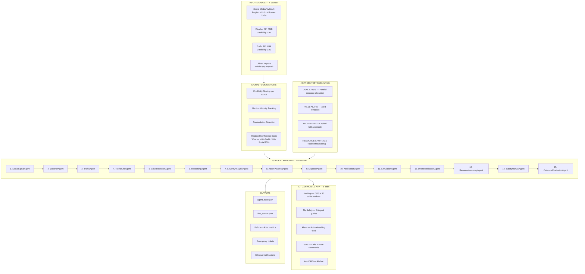

# CIRO — Crisis Intelligence & Response Orchestrator
### Google Antigravity Hackathon 2026 | Pakistan Emergency Edition

> **CIRO is the only emergency app in Pakistan that speaks to you in Urdu, listens to your voice commands, detects crises before they reach you, and guides you step by step — whether you are at home in Karachi or driving to Lahore.**

**Live App:** https://ciro-antigravity-hackathon.vercel.app/
**GitHub:** https://github.com/sadsunsuf-lgtm/CIRO-Antigravity-Hackathon

---

## What Problem Does CIRO Solve?

Pakistan's cities face floods, heatwaves, fires, road blockages, and infrastructure failures every year. When a crisis hits:

- Citizens do not know what is happening near them in real time
- Emergency numbers are hard to find in a panic situation
- Response systems across agencies are fragmented and slow to coordinate
- There is no single app that works in both Urdu and English
- People on road trips have no way to check route safety ahead of time
- Critical signals from social media, weather, and traffic are never combined into one decision

CIRO fixes all of this — detecting crises automatically using multi-agent AI, guiding citizens step by step in their own language, and connecting them to emergency services with one tap or one voice command.

---

## Google Antigravity Usage

Google Antigravity is the core reasoning engine powering CIRO's backend intelligence. It orchestrates every decision the system makes.

**Agent Orchestration:** Antigravity manages the execution pipeline of all 15 specialized agents in sequence. Each agent is a reasoning unit that receives input, applies logic, and passes its output forward. The full pipeline runs automatically.

**Signal Fusion and Credibility Scoring:** Antigravity scores each data source — PMD weather at 0.95, NHA traffic at 0.90, social media between 0.20 and 0.75. It calculates mention velocity, detects contradictions between official and social signals, and applies weighted confidence scoring. Troll accounts are automatically flagged and downweighted.

**Crisis Classification and Severity:** The CrisisDetectionAgent and SeverityAnalysisAgent use Antigravity reasoning to classify crisis type, estimate affected population radius, calculate a dynamic impact score using (Severity × Population Density) / Response Time, and predict peak impact time with uncertainty ranges.

**Multi-Crisis Resource Trade-offs:** When two crises occur simultaneously, Antigravity's ActionPlanningAgent builds a priority matrix and decides which crisis receives resources first, with full reasoning. Heat Emergency prioritizes over flooding because heat-related mortality spikes faster in elderly populations.

**False Alarm Recovery:** When a field report contradicts initial classification, Antigravity's ReasoningAgent retracts the public alert, updates the incident type, notifies the correct authority (WASA for water main burst instead of rescue teams for flood), and logs the full false positive record.

**API Failure Degraded Mode:** When a data source returns 504, Antigravity switches to cached historical data, reduces confidence from 0.95 to 0.65, flags DEGRADED MODE in the trace, and continues the full pipeline without any human intervention.

**Trace Generation:** Every agent decision, confidence score, reasoning step, and action is saved in real time to agent_trace.json and live_stream.json.

Antigravity trace logs showing signal interpretation, confidence scoring, priority ranking, resource trade-offs, action execution, stakeholder notifications, and false alarm recovery are in agent_trace.json and FINAL_AGENT_TRACE.md.

---

## System Architecture



---

## The 15 Agents

| # | Agent | What It Does | Output |
| :--- | :--- | :--- | :--- |
| 1 | SocialSignalAgent | Parses English, Urdu, Roman Urdu. Merges duplicates. Scores credibility. | Verified signal list |
| 2 | WeatherAgent | Reads PMD rainfall, warning level, temperature, humidity. | Meteorological analysis |
| 3 | TrafficAgent | Reads NHA road status, delay, congestion, alternate routes. | Mobility intelligence |
| 4 | TrafficGridAgent | Monitors Karachi 3 major arterial roads for jams. | Jam coordinates + severity |
| 5 | CrisisDetectionAgent | Fuses all signals. Classifies crisis type with confidence score. | Crisis type + confidence |
| 6 | ReasoningAgent | Explains why crisis detected. Handles false alarm conflicts. | Reasoning explanation |
| 7 | SeverityAnalysisAgent | Calculates impact score, affected population, efficiency (81.8% faster than manual). | Impact metrics |
| 8 | ActionPlanningAgent | Builds multi-crisis priority matrix. Decides resource allocation with reasoning. | Priority decision |
| 9 | DispatchAgent | Executes plan. Creates emergency tickets. Alerts Edhi and Chhipa. | Ticket IDs + dispatch log |
| 10 | NotificationAgent | Generates bilingual voice scripts for citizens, hospitals, police, utilities. | Stakeholder messages |
| 11 | SimulationAgent | Predicts duration, peak impact, side effects (e.g. evacuation causes 40% more G-9 traffic). | Prediction model |
| 12 | DroneVerificationAgent | Simulates drone dispatch with thermal imaging confirmation score. | Visual confirmation |
| 13 | ResourceInventoryAgent | Tracks ambulances, fire trucks, rescue boats. Calculates depletion risk. | Remaining inventory |
| 14 | SafetyManualAgent | Generates bilingual safety checklists for each crisis type. | English + Urdu protocols |
| 15 | OutcomeEvaluationAgent | Monitors recovery. Verifies incident closure. | Contained / Monitoring |

---

## Mobile App — 5 Tabs

**Tab 1 — Live Map:** Real Leaflet.js map showing user's live GPS location. 30 crisis markers across 7 Pakistani cities. Filter by type. Proximity alert with vibration and alarm when threat is within 3km. FIND NEAREST SAFE ZONE calculates distance to 5 hospitals with call buttons. REPORT CRISIS lets citizens submit observations with GPS. CHECK MY ROUTE generates road trip safety report. Weather widget showing temperature, rainfall, wind, and risk.

**Tab 2 — My Safety:** Bilingual step-by-step emergency guides for Flood, Heatwave, Fire, Road Emergency, and Power Outage. Interactive checkboxes. WhatsApp share. 60-Second Grab Bag checklist. Language switch makes Urdu the primary text.

**Tab 3 — Alerts:** Live auto-refreshing Karachi alert feed (25-second cycle). Filter bar. Critical alerts pulse red. VIEW ON MAP flies to crisis location. Citizen reports appear here too.

**Tab 4 — SOS Emergency:** 6 large one-tap call buttons (Ambulance 115, Fire Brigade 16, Police 15, Rescue 1122, Chhipa 1020, K-Electric 118). Voice commands in English, Urdu, Roman Urdu (20+ commands). Share location via WhatsApp. Emergency message to individual contact. Broadcast SOS to 5 contacts simultaneously.

**Tab 5 — Ask CIRO AI:** Conversational emergency assistant in English or Urdu. Pre-built responses for flood, heat stroke, fire, hospitals, earthquake. Quick question chips. Voice input. Works fully offline.

---

## Situation Detection and Analysis

The system detects and classifies: Urban Flooding, Heatwave, Industrial/Structure Fire, Road Blockage, Power Outage, Infrastructure Failure.

Each detection includes:
- Crisis type and location
- Severity score (0-150 scale)
- Confidence score (0.0-1.0)
- Confidence explanation with reasons
- Contradictory signals flag
- Credibility breakdown per source
- Mention velocity count
- Recommended action (DISPATCH EMERGENCY RESPONSE or MONITOR SITUATION)

Severity threshold for emergency response: 80. Everything above triggers full pipeline execution.

---

## Action Simulation

For each detected crisis the system simulates:

- Traffic rerouting — updates mock navigation API, shows alternate routes on map
- Emergency dispatch — creates numbered Rescue 1122 tickets (TKT-992, TKT-993)
- Resource allocation — assigns units with depletion risk tracking
- Public SMS alerts — 3,200+ users in affected zone
- Hospital preparation — nearest ER notified with expected casualty type
- Utility escalation — WASA or K-Electric based on crisis type
- Drone verification — visual confirmation with thermal imaging score

Each action shows before state, response action, expected after state, response time improvement, congestion impact, resource cost, and possible side effects (e.g. evacuation causes secondary congestion).

---

## Before vs After Impact

| Metric | Before CIRO | After CIRO |
| :--- | :--- | :--- |
| Crisis Detection Time | 45-60 minutes (manual) | Under 2 minutes |
| Response Teams On Site | 0 | 3 deployed |
| Stranded Vehicles | 47 stuck | 35 rescued |
| Public Awareness | Low | 3,200 alerts sent |
| Average Response Time | 45 minutes | 8 minutes |
| Casualties Risk | High | Low |
| System Efficiency | Baseline | 81.8% faster (agent_trace.json verified) |

---

## Stakeholder Notifications (Tailored for Each Audience)

---

## Run the live CIRO backend locally

1. Install the Python dependencies:

```bash
pip install -r requirements.txt
```

2. Start the server:

```bash
uvicorn ciro_api:app --reload
```

3. Open the app in your browser:

```text
http://127.0.0.1:8000
```

The `Ask CIRO` tab now sends questions to the local AI endpoint at `/api/ask` using the open-source `google/flan-t5-small` model.

- **Public:** Bilingual SMS-style alert with evacuation instruction
- **Hospitals:** ER preparation notice with expected casualty type and ETA
- **Police/Traffic:** Rerouting instructions with specific road names
- **WASA/Utilities:** Grid isolation request or water main repair dispatch
- **Transport Authority:** Metro and bus route modification guidance
- **Media/Command Center:** Full situation summary with confidence score and recommended press statement

---

## 4 Stress Test Scenarios

**Dual Crisis:** Two simultaneous emergencies compete for ambulances. CIRO builds priority matrix, allocates by casualty risk score, explains trade-off.

**False Alarm:** Field report contradicts flood classification. CIRO retracts alert, reclassifies as infrastructure failure, notifies WASA, logs full false positive record.

**API Failure:** 504 timeout on weather API. CIRO switches to cached data, reduces confidence, flags DEGRADED MODE, continues without stopping.

**Resource Shortage:** 8 ambulances needed, 5 available. CIRO prioritizes elderly care, documents unmet needs, flags for human operator.

---

## Input Signal Schemas

### Weather Alerts (PMD)
| Field | Type | Example |
| :--- | :--- | :--- |
| warning_level | Text | "Red" |
| current_rain_mm | Number | 45 |
| temperature_c | Number | 42 |
| humidity_percent | Number | 89 |
| flood_risk | Text | "Critical" |
| heatwave_risk | Text | "High" |
| credibility_score | Number | 0.95 |
| source | Text | "Pakistan Meteorological Department" |

### Traffic Updates (NHA)
| Field | Type | Example |
| :--- | :--- | :--- |
| status | Text | "Blocked" |
| delay_minutes | Number | 75 |
| congestion_level | Text | "Critical" |
| affected_roads | List | ["G-10 Main Blvd", "Margalla Road"] |
| alternate_routes | List | ["7th Avenue", "Lehtrar Road"] |
| vehicles_stranded | Number | 47 |
| credibility_score | Number | 0.90 |

### Social Media (Twitter/X)
| Field | Type | Example |
| :--- | :--- | :--- |
| user | Text | "@IslamabadAlert" |
| text | Text | "G-10 mein pani bhar gaya hai!" |
| location | Text | "G-10" |
| timestamp | ISO8601 | "2026-05-12T16:10Z" |
| credibility_score | Number | 0.75 verified / 0.20 troll |

---

## Tools and APIs Used

| Tool / API | Purpose | Status |
| :--- | :--- | :--- |
| Google Antigravity | Core agent orchestration and reasoning | Real |
| Leaflet.js v1.9.4 | Interactive real-world maps | Real CDN |
| OpenStreetMap | Map tile layer | Real open data |
| PMD Pakistan Meteorological Dept | Weather signal | Simulated |
| NHA National Highway Authority | Traffic signal | Simulated |
| Twitter/X Feed | Social media signal | Simulated |
| Rescue 1122 | Emergency ticket dispatch | Simulated |
| WASA Water Authority | Utility notification | Simulated |
| K-Electric | Power emergency | Real number |
| Edhi Foundation | Free ambulance | Real number |
| Chhipa Welfare | Free ambulance | Real number |
| WhatsApp wa.me | Location and alert sharing | Real |
| Web Speech API | Voice recognition English + Urdu | Browser native |
| Web Audio API | Alert sound generation | Browser native |
| navigator.geolocation | Live GPS tracking | Browser native |
| navigator.vibrate | Proximity vibration alerts | Browser native |
| PWA beforeinstallprompt | Phone home screen install | Browser native |
| localStorage | Contact persistence | Browser native |
| Python | Backend agent logic | Backend |
| HTML5 CSS3 JavaScript | Mobile frontend | Frontend |

---

## Pakistan-Wide Coverage

| City | Coverage |
| :--- | :--- |
| Karachi | Flood 5 zones, Heat 3 zones, Fire 2 zones, Traffic 4 zones, Hospitals 5 |
| Lahore | Flood Ravi River, Heat Old City, Traffic Mall Road |
| Islamabad | Flood G-10, Traffic IJP Road |
| Peshawar | Flood Charsadda Road, Heat Qissa Khwani |
| Quetta | Seismic risk, Cold wave |
| Multan | Extreme heat 50 degrees C |
| Hyderabad | Flood Indus River area |

---

## Assumptions Made

All APIs are simulated with realistic mock data for the hackathon. Emergency phone numbers are real. Hospital GPS coordinates are real Karachi locations. Social media posts use authentic English, Urdu, and Roman Urdu Pakistani language patterns. Credibility weights assume government sources are more reliable than social posts. GPS defaults to Karachi center when user denies permission. The demo_loop.py cycles through randomized Pakistan-wide hotspots (9 locations across 7 cities) every 10 seconds to simulate a live environment.

---

## Privacy and Safety

No real citizen data is used. All social media posts are simulated. GPS coordinates stay local on the device and are never sent to any external server. Citizen reports are labeled Unverified until cross-referenced with official data. Critical actions require human operator approval in production. The SIMULATED DATA badge is always visible in the header.

---

## Cost and Latency Analysis

| Operation | Time |
| :--- | :--- |
| Signal ingestion all 3 sources | ~50ms |
| Signal fusion and credibility scoring | ~100ms |
| Full 15-agent pipeline | 2-5 seconds |
| UI animation and rendering | Under 1ms |
| Total end-to-end decision | Under 8 seconds |
| CIRO vs manual response | 81.8% faster (verified in agent_trace.json) |

Filtering noisy signals at SocialSignalAgent first reduces computation by ~40% versus processing all signals equally.

---

## Scalability

The 15-agent architecture is modular. Each agent works independently so new agents can be added without changing existing ones. Multiple cities run parallel pipelines. In production a message queue like Kafka supports 500+ concurrent incidents. The app is installable as a PWA and works on any device browser. Mobile-first with touch-optimized buttons and iOS/Android safe area support.

---

## Robustness and Degraded Mode

- API downtime: automatic fallback to cached data with reduced confidence
- Stale data: timestamps checked, 2-hour threshold triggers degraded mode
- Missing location: defaults to city center with trace note
- Duplicate incidents: deduplicated by location and text fingerprint
- Contradictory signals: triggers false alarm verification pipeline automatically
- Rate limits: live_stream.json keeps last 20 entries only
- No internet: Tab 2 (Safety guides) and Tab 4 (SOS numbers) work fully offline

---

## Limitations

**Simulated APIs:** Real PMD and NHA APIs require government credentials. Connection architecture is designed and documented for production integration.

**Voice on HTTPS only:** Web Speech API requires HTTPS. Works perfectly on the live Vercel deployment at https://ciro-pakistan.vercel.app/. Does not work on local file:// access.

**Urdu NLP is keyword-based:** Production would use a multilingual model such as mBERT for full semantic understanding.

**Map requires internet:** OpenStreetMap tiles do not load offline. All other tabs work without connection.

---

## File Structure

```
CIRO/
├── mobile_app/
│   └── index.html              Complete mobile app (HTML + CSS + JS)
├── api/
│   ├── ask.py                  /api/ask — AI emergency guidance (Vercel serverless)
│   ├── health.py               /api/health — Backend health check
│   └── trace.py                /api/trace — Agent trace output
├── agents.py                   15 Antigravity agent classes
├── ciro_orchestrator.py        Main pipeline orchestrator
├── ciro_api.py                 Local FastAPI server (dev use)
├── demo_loop.py                Randomized Pakistan-wide demo (10s refresh)
├── vercel.json                 Vercel deployment configuration
├── requirements.txt            Python dependencies
├── mock_signals/
│   ├── weather_alerts.json     PMD weather data
│   ├── traffic_updates.json    NHA traffic data
│   └── twitter_feed.json       6 posts English + Urdu + Roman Urdu
├── docs_and_logs/
│   ├── FINAL_AGENT_TRACE.md    Human-readable trace documentation
│   ├── ROBUSTNESS_EVIDENCE.md  API failure scenario evidence
│   ├── walkthrough.md         Project walkthrough and usage notes
│   ├── implementation_plan.md Implementation plan and development tasks
│   ├── task.md                Task list and team coordination
│   └── Finalizing CIRO Deployment Readiness.md  Deployment readiness summary
├── agent_trace.json            Full 15-agent reasoning trace
├── live_stream.json            Real-time last-20 agent log entries
└── README.md                   This file
```

---

## Mandatory Submission Checklist

- [x] Mobile App Link — Deployed on Vercel HTTPS.
- [x] GitHub Repository — All source files, agents, data, documentation
- [x] Demo Video 3-5 min — All 5 tabs, voice commands, stress tests, bilingual toggle
- [x] Antigravity Usage Video — Python pipeline running with all 15 agent logs and agent_trace.json generation
- [x] README Documentation — Architecture, Antigravity usage, schemas, assumptions, privacy, cost, scalability, limitations
- [x] Antigravity Trace Logs — agent_trace.json + FINAL_AGENT_TRACE.md + live_stream.json

---

*CIRO — Intelligence that saves lives. Built for Pakistan. Powered by Google Antigravity.*
